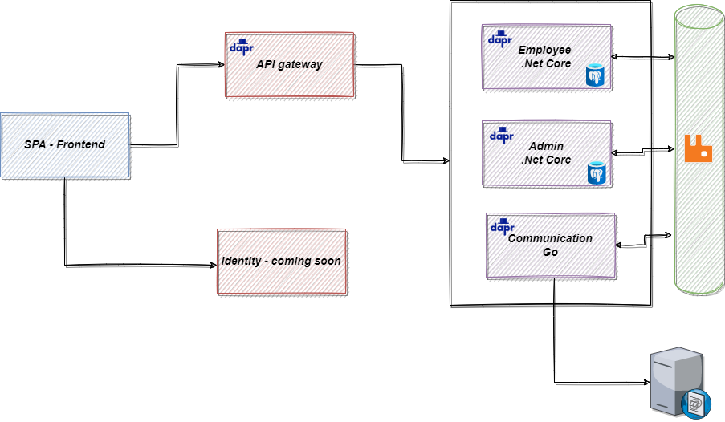

# HRM on Dapr

[](https://codecov.io/gh/tungphuong/hrmOnDapr)



The architecture consists of:

- A frontend web application that sends requests to the API gateway microservice.
- The API gateway is implemented using YAPR & .NET core. It routes imcoming requests to various backend microservices.
- Backend service is self-contained and independent of the others, including:
  - The "employee-management" service
  - The "admin" service
  - The "communication" service

Backend services can publish/subcribe message via the event bus (RabbitMQ).

## Getting started

### Run on local using Dokcer Compose

From the root folder:

```terminal
docker compose -f docker-compose.yml -f docker-compose.dev.yml up
```

When all microservices are healthy, you can access API using Rest Client in "api.http"

```curl
GET {{apiUrl}}/api/employee/{{$guid}} HTTP/1.1
Accept: application/json
```
